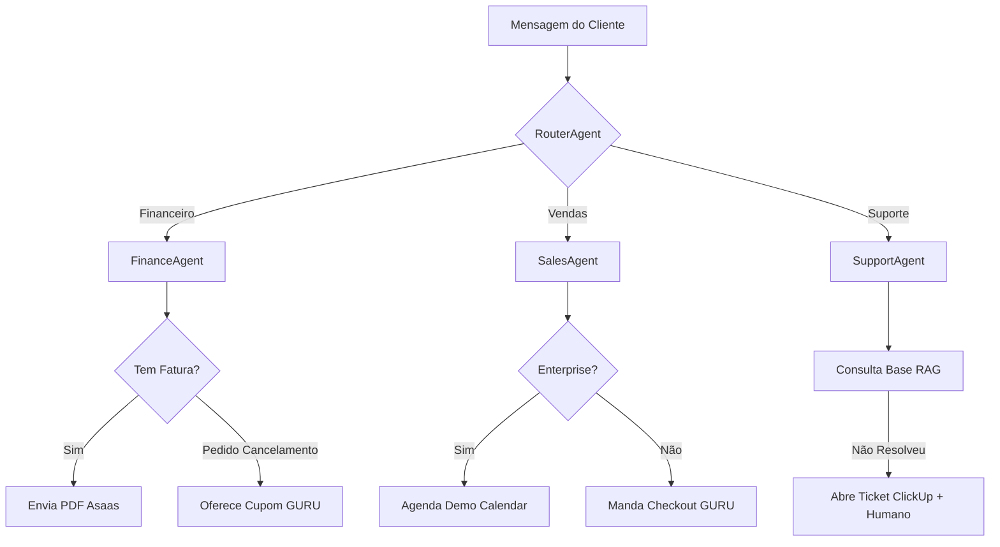

# PRD: Implementação de Funcionalidades Estratégicas - PAA v1.5

**Status:** Draft | **Versão:** 1.0.0 | **Data:** 2026-04-03
**Autor:** Antigravity (IA Specialist)

---

## 1. Visão Geral (Executive Summary)
Transformar a PAA de uma central de chat em um **motor de receita e eficiência**, automatizando processos críticos de qualificação de leads, emissão de faturas e suporte técnico via RAG (Retrieval-Augmented Generation).

---

## 2. Objetivos de Negócio (Business Goals)
- **Vendas**: Aumentar a conversão em 25% através de checkout direto no chat.
- **Financeiro**: Reduzir em 80% o tempo humano gasto com reenvio de boletos e faturas.
- **Suporte**: Alcançar >70% de resolução autônoma (Bot Containment) com base de conhecimento técnica.
- **Retenção**: Automatizar a oferta de cupons para reduzir o Churn em solicitações de cancelamento.

---

## 3. Requisitos Funcionais (Épicos)

### Épico 1: Aceleração de Vendas (Comercial)
| Feature | Descrição | Regras de Negócio |
| :--- | :--- | :--- |
| **F1.1: Qualificação Ativa** | Tool `qualifyLead` para o SalesAgent. | Deve coletar: Nome da Empresa, Cargo e Nº de Funcionários. Atualiza banco `customers`. |
| **F1.2: Checkout no Chat** | Tool `generateCheckoutLink` (GURU). | Padrão: Plano Premium. Oferecer via link clicável assim que a intenção de compra for detectada. |
| **F1.3: Agenda de Demos** | Integração com Google Calendar. | Se Lead = Enterprise, agendar demo em vez de mandar checkout. |

### Épico 2: Autoatendimento Financeiro
| Feature | Descrição | Regras de Negócio |
| :--- | :--- | :--- |
| **F2.1: Segunda Via Automática** | Tool `resendBoleto` (Asaas). | Identificar fatura atrasada via `getInvoice` e oferecer o link do PDF/Pix na hora. |
| **F2.2: Motor de Retenção** | Tool `applyRetentionCoupon` (GURU). | Se intenção = 'cancelar', oferecer 20% de desconto por 3 meses ANTES de passar para o humano. |

### Épico 3: Suporte Inteligente (RAG)
| Feature | Descrição | Regras de Negócio |
| :--- | :--- | :--- |
| **F3.1: Base de Conhecimento** | Implementação de Busca Vetorial. | O SupportAgent deve consultar PDFs/Notion indexados no Supabase (Vector Store). |
| **F3.2: Tickets Externos** | Tool `createExternalTicket`. | Se problema persistir > 3 tentativas, abrir ticket no ClickUp com o histórico completo. |

---

## 4. Requisitos Técnicos e Arquitetura

### 4.1 Experiência do Desenvolvedor (DX)
- **Novos Serviços**: Criar `src/integrations/guru-api.ts` e `src/integrations/asaas-api.ts` (implementação real dos placeholders).
- **RAG Engine**: Utilizar o modelo `text-embedding-3-small` da OpenAI ou similar via LangChain no Supabase.

### 4.2 Fluxo de Interação (Handoff)

---

## 5. Plano de Entrega (Milestones)

- **M1 (Vendas & Financeiro)**: Ativação das APIs reais GURU/Asaas e ferramentas de checkout/boleto. (Tempo: 1 semana)
- **M2 (Inteligência Suporte)**: Setup da Base Vetorial e Indexação de documentos. (Tempo: 2 semanas)
- **M3 (Ecossistema)**: Dashboards de KPI para acompanhar a eficácia das novas automações. (Tempo: 1 semana)

---

## 6. Riscos e Mitigações
- **Risco**: IA conceder descontos indevidos.
- **Mitigação**: Trava de segurança no código (`FINANCE_CONFIG.maxRetentionDiscount`) impedindo valores > 30%.
- **Risco**: RAG alucinar sobre regras técnicas.
- **Mitigação**: Prompt forcing para responder "Não sei" e escalar de imediato se a confiança for < 0.8.

---

> [!IMPORTANT]
> **Próxima Ação:** Aprovação deste PRD para início da codificação das integrações GURU (Sales) e Asaas (Finance).
